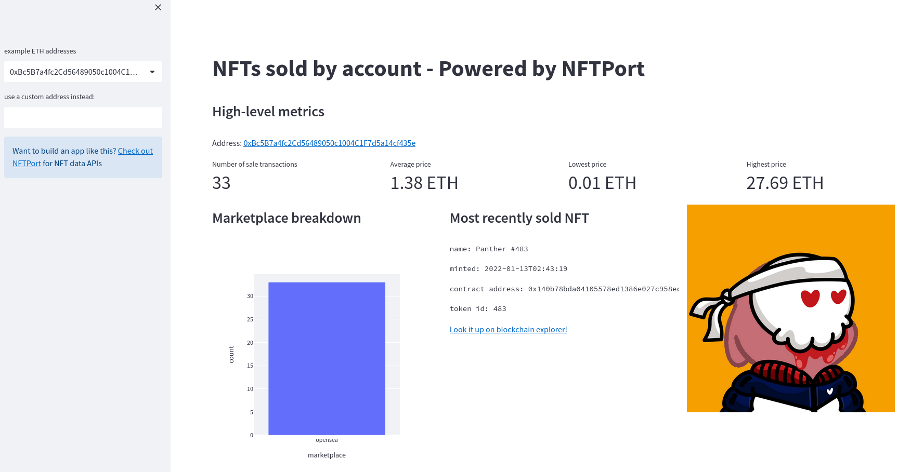

# NFTs sold by account - Powered by NFTPort


The app is available on Streamlit Cloud: https://zseta-nftport-demo-app-v7lcml.streamlit.app/

## Prerequisites
* Python 3
* [Virtualenv](https://virtualenv.pypa.io/en/latest/)
* NFTPort API key - [sign up here for free][sign-up]

## Run the app locally
1.  Clone the repository:
    ```bash
    git clone https://github.com/zseta/nftport-demo
    cd  nftport-demo
    ```
1.  Create a new virtual environment, activate it and install the requirements:
    ```bash
    virtualenv env && source env/bin/activate
    pip install -r requirements.txt
    ```
    This will install Streamlit, Plotly, requests, and their all of their dependencies
1. Open the streamlit secrets file and add your NFTPort API key
    ```bash
	nano ./streamlit/secrets.toml
    [NFTPORT]
    APIKEY = "YOUR-API-KEY-HERE"
	```
1. Run the app:
    ```bash
	streamlit run app.py
	```

## How to use the app
The app lets you analyze sale transactions made by a specific account on the
Ethereum blockchain.

1. Provide an account/wallet address 
    You can either choose an address from the dropdown list, as an example, or
    you can also provide a custom ETH address that you want to analyze.
2. The dashboard automatically updates once you hit enter.

### Dashboard
**High-level metrics**

* Number of transactions
* Average sale price
* Lowest sale price
* Highest sale price

**Marketplace breakdown**

This column chart shows how many of the sale transactions happened on each
marketplace. If there's only one marketplace that was used for the transactions
then only one column will be displayed (e.g. opensea).

**Most recently sold NFT**

This block shows details about the NFT that was most recently sold using the
given address. You can also analyze the transaction further by clicking on the
blockchain explorer link. Right next to this block, the app also displays the
image of the NFT.

**Most recent transactions**

This table displays the five most recent sale transactions of the given address
and provides more details about them like `date`, `marketplace`,
`price_currency`, `price_value`, `quantity`, `hash`.

**Sales volume & count**

This section displays two time-series charts of the sales volume (in ETH) and
sales count (number of sale transactions) that this address historically.
Below the charts, you can also see the raw data that was used to generate the
charts.

## Powered by NFTPort
All the data points displayed on the dashboard are provided by [NFTPort](https://www.nftport.xyz/).
More specifically, the dashboard uses the following NFTPort API endpoints:
* [/transactions/accounts/](https://docs.nftport.xyz/docs/nftport/b3A6MzAxNDQ3NzQ-retrieve-transactions-by-an-account)
* [/nfts/](https://docs.nftport.xyz/docs/nftport/b3A6MjAzNDUzNTM-retrieve-nft-details)

NFTPort provides simple REST APIs to fetch, mint or even search NFTs. There's a
free tier available that you can use to [try the API][sign-up].


[sign-up]: https://dashboard.nftport.xyz/sign-up
